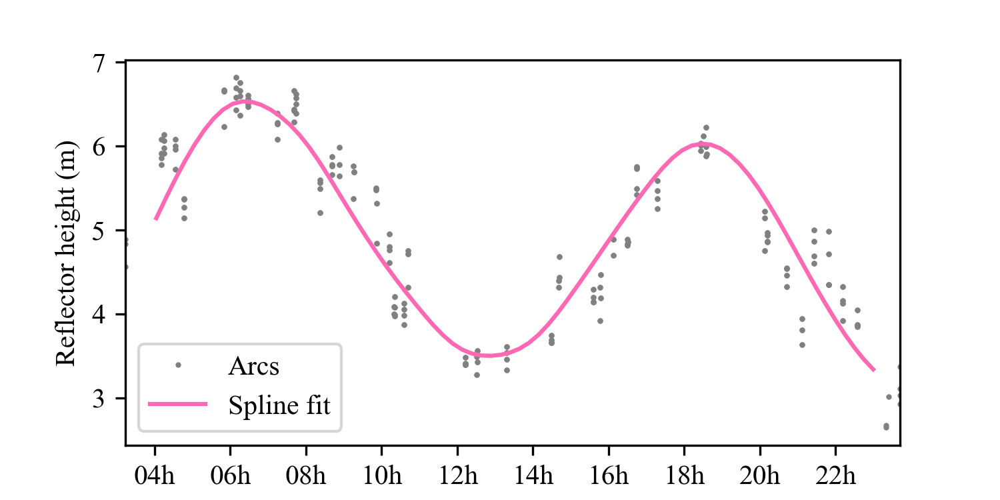

# gnssir_rt
This software is to go with "Real-time water levels using GNSS-IR: a potential tool for flood monitoring" by Purnell et al. (Geophysical Research Letters)
All code written by David Purnell except for gnssr/make_gpt.py (written by Kristine Larson)

## Installation
Requires python >= 3.9, git and pip.

```
git clone https://github.com/purnelldj/gnssir_rt.git
cd gnssir_rt
python -m pip install -e .
```

## How to use the code
Below is an example of how to process one day of data from Saint-Joseph-de-la-Rive.

### Step 1: initialise localproc directory
```
python init_localproc.py
```

### Step 2: process test data
```
python main_cl.py sjdlr arcs2splines
```
this command should produce the following plot:



### general usage
```
python main_cl.py [station] [funcname]
```
* `[station]` corresponds to a file: `site_inputs/[station].py` (either `sjdlr` or `rv3s`)
* `[funcname]` is one of `snr2arcs`, `arcsplot` or `arcs2splines`
You can edit the station file in site_inputs as desired

## Article data
SNR data to go with the paper can be found [here](https://doi.org/10.5281/zenodo.10114719). It can be downloaded using zenodo_get

```
zenodo_get 10.5281/zenodo.10114719
```
Note: this will take a few minutes (~ 1Gb of data)

## SNR data format
The SNR data format is similar to [this format](https://gnssrefl.readthedocs.io/en/latest/pages/file_structure.html#the-snr-data-format), but with differences on fourth and fifth columns:
* instead of seconds of day in the fourth column it is [GPS time](https://docs.astropy.org/en/stable/api/astropy.time.TimeGPS.html)
* the fifth column is L1 SNR (there are only five columns)
